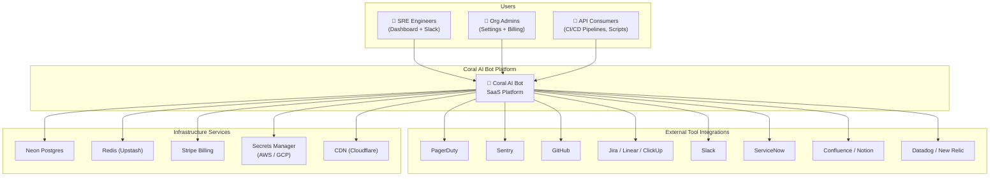
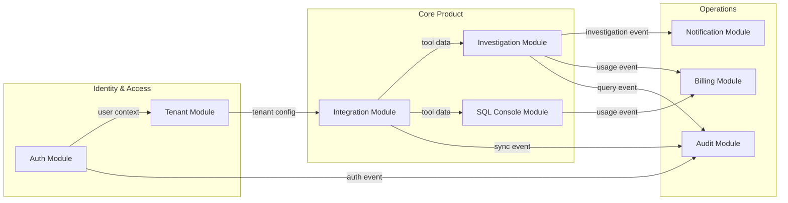
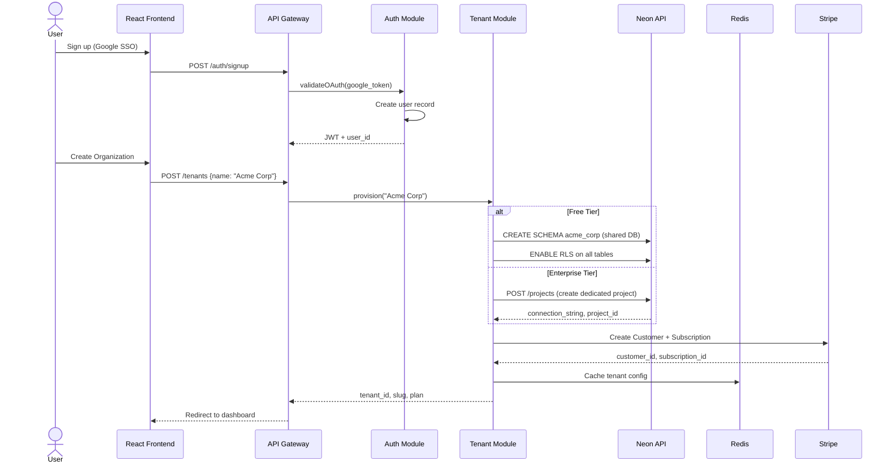
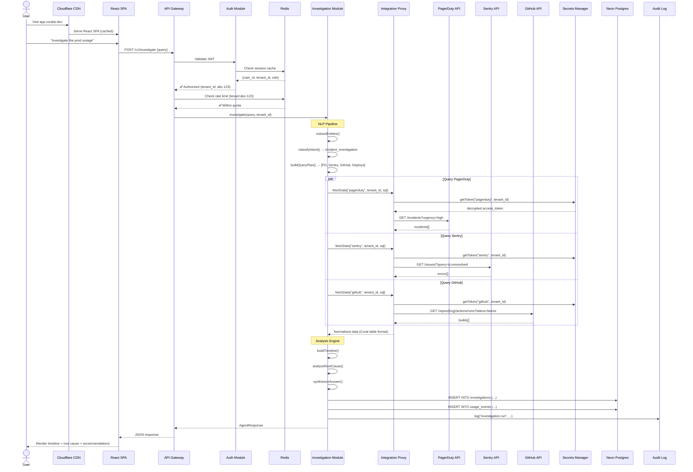
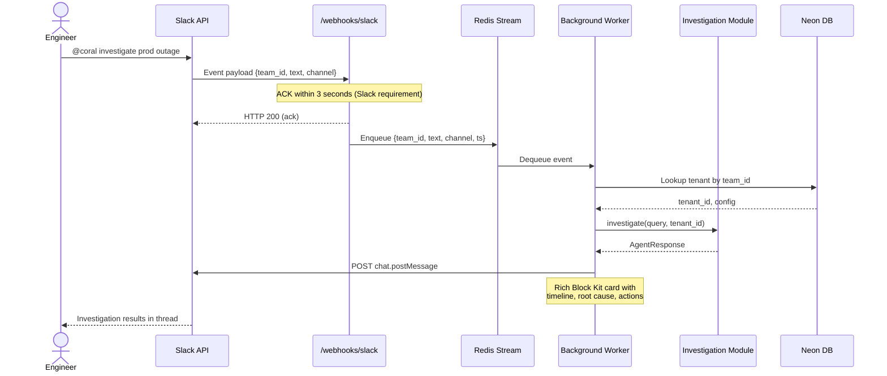

# Coral AI Bot — System Architecture Design

> Complete architecture for transforming the current single-tenant SRE monolith into a production-grade, multi-tenant SaaS platform.

---

## 1. Architecture Philosophy

### Core Decisions

| Decision | Choice | Rationale |
|----------|--------|-----------|
| **Architecture Style** | Modular Monolith (DDD) | Team < 15 devs; extract to microservices later as needed |
| **Database Isolation** | Hybrid — Shared Schema + RLS (free), Neon Project-per-Tenant (enterprise) | Cost-efficient for SMBs, true isolation for compliance |
| **Auth Model** | OAuth2 + PKCE (SSO), Scoped API Keys (programmatic) | Industry standard, no vendor lock-in |
| **Event Processing** | Redis Streams (MVP) → Kafka (scale) | Start simple, scale later |
| **Infrastructure** | Serverless-first (Cloud Run / Vercel) | Focus on product, not ops |
| **API Design** | Contract-first (OpenAPI 3.1) | API-first = SaaS-first |

### Guiding Principles
1. **Tenant context is a first-class citizen** — resolved at the edge, propagated everywhere
2. **No raw data storage** — tool data is queried live via APIs, never cached permanently
3. **Modular boundaries = future service boundaries** — extract only when scaling demands it
4. **Security by default** — encrypted credentials, RBAC, audit logging from day one

---

## 2. System Context (C4 Level 1)

The highest-level view — who interacts with the system and what external systems it connects to.



---

## 3. Container Architecture (C4 Level 2)

The platform internals — decomposed into **7 layers**, each with clear boundaries.

```
┌──────────────────────────────────────────────────────────────────────────────────────┐
│                              LAYER 1: EDGE & CDN                                     │
│  ┌────────────────────────────────────────────────────────────────────────────────┐   │
│  │  Cloudflare / Vercel Edge  →  SSL termination, WAF, DDoS, geo-routing         │   │
│  │  Static assets (React SPA) served from CDN edge nodes                          │   │
│  └────────────────────────────────────────────────────────────────────────────────┘   │
├──────────────────────────────────────────────────────────────────────────────────────┤
│                          LAYER 2: API GATEWAY                                        │
│  ┌────────────────────────────────────────────────────────────────────────────────┐   │
│  │  Authentication (JWT decode / API Key lookup)                                  │   │
│  │  Tenant Resolution (JWT claims → tenant_id)                                    │   │
│  │  Rate Limiting (per-tenant token bucket via Redis)                             │   │
│  │  Request Validation (OpenAPI schema)                                           │   │
│  │  CORS / Security Headers                                                       │   │
│  └────────────────────────────────────────────────────────────────────────────────┘   │
├──────────────────────────────────────────────────────────────────────────────────────┤
│                     LAYER 3: CORE SERVICES (Modular Monolith)                        │
│                                                                                      │
│  ┌──────────────┐  ┌──────────────┐  ┌──────────────┐  ┌──────────────────────┐     │
│  │  Auth Module  │  │  Tenant      │  │  Integration │  │  Investigation       │     │
│  │              │  │  Module      │  │  Module      │  │  Module (AI Agent)   │     │
│  │  • SSO/OAuth │  │  • Provision │  │  • OAuth     │  │  • NLP Pipeline      │     │
│  │  • API Keys  │  │  • Settings  │  │  • Token Mgmt│  │  • SQL Generation    │     │
│  │  • RBAC      │  │  • Users     │  │  • Sync      │  │  • Cross-Source JOIN │     │
│  │  • Sessions  │  │  • Billing   │  │  • Health    │  │  • Timeline Builder  │     │
│  └──────┬───────┘  └──────┬───────┘  └──────┬───────┘  │  • Root Cause Engine │     │
│         │                 │                 │          │  • Answer Synthesis  │     │
│  ┌──────┴───────┐  ┌──────┴───────┐  ┌──────┴───────┐  └──────────┬───────────┘     │
│  │  Billing     │  │  Notification│  │  SQL Console │              │                 │
│  │  Module      │  │  Module      │  │  Module      │              │                 │
│  │              │  │              │  │              │              │                 │
│  │  • Stripe    │  │  • Slack Bot │  │  • Query Exec│              │                 │
│  │  • Metering  │  │  • Email     │  │  • Schema    │              │                 │
│  │  • Plans     │  │  • Webhook   │  │  • Introspect│              │                 │
│  └──────────────┘  └──────────────┘  └──────────────┘              │                 │
├──────────────────────────────────────────────────────────────┬─────┴─────────────────┤
│                    LAYER 4: INTEGRATION PROXY                │                       │
│  ┌────────────────────────────────────────────────────────┐  │  LAYER 5: CORAL       │
│  │  Unified adapter interface for all SaaS tools          │  │  SQL ENGINE           │
│  │                                                        │  │                       │
│  │  ┌────────┐ ┌────────┐ ┌────────┐ ┌────────┐          │  │  • Coral CLI wrapper  │
│  │  │PagerDty│ │ Sentry │ │ GitHub │ │  Jira  │          │  │  • SQL federation    │
│  │  │Adapter │ │Adapter │ │Adapter │ │Adapter │   ...    │  │  • Cross-source JOIN │
│  │  └────────┘ └────────┘ └────────┘ └────────┘          │  │  • Schema discovery  │
│  │                                                        │  │  • Query caching     │
│  │  • Credential fetch from Vault per tenant              │  │                       │
│  │  • Response normalization to Coral table schema         │  │                       │
│  │  • Circuit breaker + retry + backoff                   │  │                       │
│  └────────────────────────────────────────────────────────┘  └───────────────────────┤
├──────────────────────────────────────────────────────────────────────────────────────┤
│                         LAYER 6: DATA LAYER                                          │
│                                                                                      │
│  ┌───────────────────────────┐  ┌───────────────────────────────────────────────┐    │
│  │  Control Plane Database   │  │  Tenant Data (Per-Tenant Isolation)           │    │
│  │  (Shared Neon Project)    │  │                                               │    │
│  │                           │  │  FREE TIER:                                   │    │
│  │  • tenants                │  │    Shared schema + Row-Level Security (RLS)   │    │
│  │  • users                  │  │    tenant_id column on every row              │    │
│  │  • integrations           │  │                                               │    │
│  │  • api_keys               │  │  ENTERPRISE TIER:                             │    │
│  │  • investigations         │  │    Dedicated Neon Project per tenant           │    │
│  │  • audit_logs             │  │    Complete resource + security isolation      │    │
│  │  • billing_events         │  │    Independent Point-in-Time Recovery          │    │
│  └───────────────────────────┘  └───────────────────────────────────────────────┘    │
│                                                                                      │
│  ┌───────────────────────────┐  ┌───────────────────────────────────────────────┐    │
│  │  Redis (Upstash)          │  │  Secrets Manager                              │    │
│  │                           │  │  (AWS SM / GCP Secret Manager / Vault)        │    │
│  │  • Session cache          │  │                                               │    │
│  │  • Rate limit counters    │  │  • OAuth tokens (AES-256-GCM encrypted)      │    │
│  │  • Event stream (Streams) │  │  • API keys (bcrypt hashed in DB)            │    │
│  │  • Distributed locks      │  │  • DB connection strings                      │    │
│  └───────────────────────────┘  └───────────────────────────────────────────────┘    │
├──────────────────────────────────────────────────────────────────────────────────────┤
│                        LAYER 7: OBSERVABILITY                                        │
│  ┌────────────────────────────────────────────────────────────────────────────────┐   │
│  │  Structured Logging (Pino) → Log aggregation (Datadog / Grafana Cloud)        │   │
│  │  Metrics (OpenTelemetry)  → Dashboards (query latency, error rates)           │   │
│  │  Tracing (OpenTelemetry)  → Distributed traces with tenant_id tags            │   │
│  │  Audit Log Stream         → Immutable append-only log for compliance          │   │
│  └────────────────────────────────────────────────────────────────────────────────┘   │
└──────────────────────────────────────────────────────────────────────────────────────┘
```

---

## 4. Bounded Contexts (DDD Module Map)

Each module is a **bounded context** — a self-contained domain with clear interfaces. This is the future microservice boundary map.



### Module Responsibilities

| Module | Owns | Exposes | Depends On |
|--------|------|---------|------------|
| **Auth** | Users, sessions, API keys, RBAC | `authenticate()`, `authorize()`, `createApiKey()` | Tenant |
| **Tenant** | Orgs, plans, settings, onboarding | `provision()`, `getConfig()`, `listUsers()` | Auth, Billing |
| **Integration** | OAuth flows, token vault, adapters | `connect()`, `disconnect()`, `fetchData()`, `healthCheck()` | Tenant, Secrets Manager |
| **Investigation** | AI agent, NLP, SQL generation, analysis | `investigate()`, `getHistory()` | Integration, SQL Console |
| **SQL Console** | Query execution, schema introspection | `executeQuery()`, `getSchema()`, `getTables()` | Integration, Coral Engine |
| **Billing** | Stripe sync, metering, plan enforcement | `checkQuota()`, `recordUsage()`, `getInvoice()` | Tenant, Stripe |
| **Notification** | Slack bot, email, webhooks | `sendSlackAlert()`, `sendEmail()`, `fireWebhook()` | Tenant, Integration |
| **Audit** | Immutable event log | `log()`, `search()`, `export()` | All modules emit events |

---

## 5. Tenant Lifecycle & Data Isolation

### 5.1 Tenant Provisioning Flow



### 5.2 Hybrid Isolation Model

```
┌─────────────────────────────────────────────────────────────────────────┐
│                        NEON CONTROL PLANE                               │
│                    (Shared Neon Project)                                 │
│                                                                         │
│  ┌───────────────────────────────────────────────────────────────────┐  │
│  │  control_plane database                                           │  │
│  │                                                                   │  │
│  │  tenants │ users │ api_keys │ integrations │ billing │ audit_logs │  │
│  └───────────────────────────────────────────────────────────────────┘  │
├─────────────────────────────────────────────────────────────────────────┤
│                                                                         │
│  FREE / PRO TIER: Shared Schema + Row-Level Security                    │
│  ┌───────────────────────────────────────────────────────────────────┐  │
│  │  shared_tenant_data database                                      │  │
│  │                                                                   │  │
│  │  Every table has: tenant_id UUID NOT NULL                         │  │
│  │  RLS Policy: current_setting('app.tenant_id') = tenant_id        │  │
│  │                                                                   │  │
│  │  investigations │ cached_results │ custom_services │ preferences  │  │
│  │                                                                   │  │
│  │  ┌──────────────────────────────────────────────┐                 │  │
│  │  │ Tenant A rows │ Tenant B rows │ Tenant C rows │  ← invisible  │  │
│  │  │  (RLS filter)  │  (RLS filter)  │  (RLS filter) │  to each    │  │
│  │  └──────────────────────────────────────────────┘    other       │  │
│  └───────────────────────────────────────────────────────────────────┘  │
│                                                                         │
│  ENTERPRISE TIER: Dedicated Neon Project                                │
│  ┌─────────────────┐  ┌─────────────────┐  ┌─────────────────┐        │
│  │ Neon Project:    │  │ Neon Project:    │  │ Neon Project:    │       │
│  │ tenant_acme      │  │ tenant_globex    │  │ tenant_initech   │       │
│  │                  │  │                  │  │                  │       │
│  │ Full isolation   │  │ Full isolation   │  │ Full isolation   │       │
│  │ Own compute      │  │ Own compute      │  │ Own compute      │       │
│  │ Own PITR         │  │ Own PITR         │  │ Own PITR         │       │
│  │ Own connection   │  │ Own connection   │  │ Own connection   │       │
│  │ string           │  │ string           │  │ string           │       │
│  └─────────────────┘  └─────────────────┘  └─────────────────┘        │
└─────────────────────────────────────────────────────────────────────────┘
```

### 5.3 Row-Level Security Implementation

```sql
-- Enable RLS on investigation history table
ALTER TABLE investigations ENABLE ROW LEVEL SECURITY;

-- Policy: Users can only see their tenant's data
CREATE POLICY tenant_isolation ON investigations
    USING (tenant_id = current_setting('app.tenant_id')::uuid);

-- At request time (middleware sets this before every query):
SET LOCAL app.tenant_id = 'tenant-uuid-here';

-- Now all queries are automatically scoped:
SELECT * FROM investigations;
-- ↑ Only returns rows where tenant_id matches
```

---

## 6. Control Plane Database Schema

```sql
-- ═══════════════════════════════════════════════════════════
-- CONTROL PLANE SCHEMA (shared across all tenants)
-- ═══════════════════════════════════════════════════════════

-- Organizations
CREATE TABLE tenants (
    id              UUID PRIMARY KEY DEFAULT gen_random_uuid(),
    name            VARCHAR(255) NOT NULL,
    slug            VARCHAR(100) UNIQUE NOT NULL,
    plan            VARCHAR(50) DEFAULT 'starter',  -- starter | pro | enterprise
    status          VARCHAR(20) DEFAULT 'active',   -- active | suspended | churned
    neon_project_id VARCHAR(255),                    -- NULL for shared tier
    neon_conn_string TEXT,                           -- encrypted, NULL for shared
    stripe_customer_id VARCHAR(255),
    stripe_subscription_id VARCHAR(255),
    settings        JSONB DEFAULT '{}',             -- custom config, service names, etc.
    created_at      TIMESTAMPTZ DEFAULT NOW(),
    updated_at      TIMESTAMPTZ DEFAULT NOW()
);

-- Users
CREATE TABLE users (
    id              UUID PRIMARY KEY DEFAULT gen_random_uuid(),
    tenant_id       UUID NOT NULL REFERENCES tenants(id) ON DELETE CASCADE,
    email           VARCHAR(255) NOT NULL,
    name            VARCHAR(255),
    avatar_url      TEXT,
    role            VARCHAR(50) DEFAULT 'member',   -- owner | admin | member | viewer
    auth_provider   VARCHAR(50),                    -- google | github | saml
    auth_provider_id VARCHAR(255),
    last_login_at   TIMESTAMPTZ,
    created_at      TIMESTAMPTZ DEFAULT NOW(),
    UNIQUE(tenant_id, email)
);

-- Integration Connections
CREATE TABLE integrations (
    id              UUID PRIMARY KEY DEFAULT gen_random_uuid(),
    tenant_id       UUID NOT NULL REFERENCES tenants(id) ON DELETE CASCADE,
    provider        VARCHAR(50) NOT NULL,           -- pagerduty | sentry | github | jira | slack | servicenow | confluence
    display_name    VARCHAR(255),
    status          VARCHAR(20) DEFAULT 'pending',  -- pending | active | error | revoked
    scopes          TEXT[],
    access_token_enc BYTEA,                         -- AES-256-GCM encrypted
    refresh_token_enc BYTEA,                        -- AES-256-GCM encrypted
    token_expires_at TIMESTAMPTZ,
    config          JSONB DEFAULT '{}',             -- provider-specific: org, domain, project, etc.
    last_sync_at    TIMESTAMPTZ,
    error_message   TEXT,
    created_at      TIMESTAMPTZ DEFAULT NOW(),
    updated_at      TIMESTAMPTZ DEFAULT NOW(),
    UNIQUE(tenant_id, provider)
);

-- API Keys
CREATE TABLE api_keys (
    id              UUID PRIMARY KEY DEFAULT gen_random_uuid(),
    tenant_id       UUID NOT NULL REFERENCES tenants(id) ON DELETE CASCADE,
    created_by      UUID REFERENCES users(id),
    name            VARCHAR(255) NOT NULL,
    key_prefix      VARCHAR(16) NOT NULL,           -- "coral_sk_a3f..." for display
    key_hash        VARCHAR(128) NOT NULL,           -- bcrypt hash of full key
    scopes          TEXT[] DEFAULT '{read,investigate}',
    rate_limit      INTEGER DEFAULT 100,             -- requests per minute
    last_used_at    TIMESTAMPTZ,
    expires_at      TIMESTAMPTZ,
    revoked_at      TIMESTAMPTZ,
    created_at      TIMESTAMPTZ DEFAULT NOW()
);

-- Investigation History
CREATE TABLE investigations (
    id              UUID PRIMARY KEY DEFAULT gen_random_uuid(),
    tenant_id       UUID NOT NULL REFERENCES tenants(id) ON DELETE CASCADE,
    user_id         UUID REFERENCES users(id),
    query           TEXT NOT NULL,
    intent          VARCHAR(50),
    answer          TEXT,
    sql_queries     TEXT[],
    timeline        JSONB,
    root_cause      JSONB,
    coral_features  TEXT[],
    duration_ms     INTEGER,
    source          VARCHAR(20) DEFAULT 'dashboard', -- dashboard | api | slack
    created_at      TIMESTAMPTZ DEFAULT NOW()
);

-- Audit Log (append-only, immutable)
CREATE TABLE audit_logs (
    id              UUID PRIMARY KEY DEFAULT gen_random_uuid(),
    tenant_id       UUID NOT NULL,
    user_id         UUID,
    action          VARCHAR(100) NOT NULL,           -- auth.login | integration.connect | investigation.run | api_key.create
    resource_type   VARCHAR(50),
    resource_id     UUID,
    metadata        JSONB DEFAULT '{}',
    ip_address      INET,
    user_agent      TEXT,
    created_at      TIMESTAMPTZ DEFAULT NOW()
);

-- Usage Metering (for Stripe billing)
CREATE TABLE usage_events (
    id              UUID PRIMARY KEY DEFAULT gen_random_uuid(),
    tenant_id       UUID NOT NULL REFERENCES tenants(id),
    event_type      VARCHAR(50) NOT NULL,            -- investigation | sql_query | api_call
    quantity        INTEGER DEFAULT 1,
    metadata        JSONB DEFAULT '{}',
    billed          BOOLEAN DEFAULT FALSE,
    created_at      TIMESTAMPTZ DEFAULT NOW()
);

-- Indexes
CREATE INDEX idx_users_tenant ON users(tenant_id);
CREATE INDEX idx_integrations_tenant ON integrations(tenant_id);
CREATE INDEX idx_investigations_tenant_created ON investigations(tenant_id, created_at DESC);
CREATE INDEX idx_audit_tenant_created ON audit_logs(tenant_id, created_at DESC);
CREATE INDEX idx_audit_action ON audit_logs(action);
CREATE INDEX idx_usage_tenant_billed ON usage_events(tenant_id, billed, created_at);
CREATE INDEX idx_api_keys_hash ON api_keys(key_hash);
```

---

## 7. API Contract (OpenAPI Summary)

### Authentication Headers
```
Authorization: Bearer <jwt_token>       # Dashboard sessions (cookie-based)
X-API-Key: coral_sk_abc123...           # Programmatic API access
X-Tenant-ID: <resolved from JWT/key>    # Auto-injected by gateway
```

### Endpoint Map

```
Auth & Identity
━━━━━━━━━━━━━━━━━━━━━━━━━━━━━━━━━━━━━━━━━━━━━━━━━━━━━━━━━━━━━
POST   /auth/login/google               Google OAuth callback
POST   /auth/login/github               GitHub OAuth callback
POST   /auth/logout                     Destroy session
GET    /auth/me                         Current user + tenant context

Tenant Management
━━━━━━━━━━━━━━━━━━━━━━━━━━━━━━━━━━━━━━━━━━━━━━━━━━━━━━━━━━━━━
POST   /v1/tenants                      Create organization
GET    /v1/tenants/:slug                Get tenant details
PATCH  /v1/tenants/:slug                Update settings (service names, etc.)
GET    /v1/tenants/:slug/users          List team members
POST   /v1/tenants/:slug/users/invite   Invite user via email

Integrations
━━━━━━━━━━━━━━━━━━━━━━━━━━━━━━━━━━━━━━━━━━━━━━━━━━━━━━━━━━━━━
GET    /v1/integrations                 List connected tools
POST   /v1/integrations/:provider/auth  Start OAuth flow
GET    /v1/integrations/:provider/callback  OAuth callback
DELETE /v1/integrations/:id             Disconnect tool
GET    /v1/integrations/:id/health      Check connection health

Investigation (Core Product)
━━━━━━━━━━━━━━━━━━━━━━━━━━━━━━━━━━━━━━━━━━━━━━━━━━━━━━━━━━━━━
POST   /v1/investigate                  Run AI investigation
GET    /v1/investigations               List past investigations
GET    /v1/investigations/:id           Get investigation detail

SQL Console
━━━━━━━━━━━━━━━━━━━━━━━━━━━━━━━━━━━━━━━━━━━━━━━━━━━━━━━━━━━━━
POST   /v1/query                        Execute SQL query
GET    /v1/schema/tables                List available tables
GET    /v1/schema/columns               List columns for all tables

API Keys
━━━━━━━━━━━━━━━━━━━━━━━━━━━━━━━━━━━━━━━━━━━━━━━━━━━━━━━━━━━━━
GET    /v1/api-keys                     List API keys (prefix only)
POST   /v1/api-keys                     Generate new API key
DELETE /v1/api-keys/:id                 Revoke API key

Billing
━━━━━━━━━━━━━━━━━━━━━━━━━━━━━━━━━━━━━━━━━━━━━━━━━━━━━━━━━━━━━
GET    /v1/billing/usage                Current period usage
GET    /v1/billing/plan                 Current plan details
POST   /v1/billing/portal               Stripe customer portal link

Webhooks (Incoming)
━━━━━━━━━━━━━━━━━━━━━━━━━━━━━━━━━━━━━━━━━━━━━━━━━━━━━━━━━━━━━
POST   /webhooks/stripe                 Stripe billing events
POST   /webhooks/slack/events           Slack event subscriptions
POST   /webhooks/slack/commands         Slack slash commands

Health
━━━━━━━━━━━━━━━━━━━━━━━━━━━━━━━━━━━━━━━━━━━━━━━━━━━━━━━━━━━━━
GET    /health                          Platform health
GET    /health/ready                    Readiness probe (K8s)
```

---

## 8. Request Lifecycle (End-to-End)

A single investigation request flows through the entire stack:



---

## 9. Integration Proxy Architecture

The Integration Proxy is the **secure bridge** between tenant credentials and external APIs.

```
┌──────────────────────────────────────────────────────────────────────────┐
│                      INTEGRATION PROXY                                   │
│                                                                          │
│  ┌──────────────────────────────────────────────────┐                   │
│  │              Adapter Interface                    │                   │
│  │                                                   │                   │
│  │  interface ToolAdapter {                           │                   │
│  │    connect(tenant_id, oauth_code): Promise<void>   │                   │
│  │    disconnect(tenant_id): Promise<void>             │                   │
│  │    healthCheck(tenant_id): Promise<HealthStatus>    │                   │
│  │    fetchData(tenant_id, table, filters):            │                   │
│  │         Promise<CoralRow[]>                         │                   │
│  │    getSchema(): TableDefinition[]                   │                   │
│  │  }                                                 │                   │
│  └──────────────────────────────────────────────────┘                   │
│           │         │         │          │          │                    │
│  ┌────────┴──┐ ┌────┴────┐ ┌──┴─────┐ ┌──┴────┐ ┌──┴──────┐           │
│  │ PagerDuty │ │  Sentry │ │ GitHub │ │  Jira │ │  Slack  │   ...     │
│  │  Adapter  │ │ Adapter │ │Adapter │ │Adapter│ │ Adapter │           │
│  │           │ │         │ │        │ │       │ │         │           │
│  │  Maps:    │ │ Maps:   │ │ Maps:  │ │ Maps: │ │ Maps:   │           │
│  │  /incidents│ │ /issues │ │ /runs  │ │ /search│ │ /history│           │
│  │  → pagerduty│ │ → sentry│ │ → github│ │ → enterprise│ │ → slack│    │
│  │  .incidents│ │ .errors │ │ .builds│ │ .tickets│ │ .threads│          │
│  └───────────┘ └─────────┘ └────────┘ └───────┘ └─────────┘           │
│                                                                          │
│  Cross-Cutting Concerns:                                                 │
│  ┌──────────────┐ ┌──────────────┐ ┌──────────────┐ ┌───────────────┐  │
│  │ Circuit       │ │  Retry +     │ │  Response    │ │  Rate Limit   │  │
│  │ Breaker      │ │  Backoff     │ │  Cache (5m)  │ │  (per-tenant) │  │
│  └──────────────┘ └──────────────┘ └──────────────┘ └───────────────┘  │
└──────────────────────────────────────────────────────────────────────────┘
```

> [!IMPORTANT]
> **No raw data is stored permanently.** The Integration Proxy queries external APIs in real-time. A 5-minute response cache (Redis) prevents hitting API rate limits during multi-query investigations. Cache keys include `tenant_id` to prevent cross-tenant data leakage.

---

## 10. Slack Bot Architecture



### Slack App Configuration
- **Distribution:** Unlisted (OAuth via "Add to Slack" button on our dashboard)
- **Framework:** Slack Bolt (TypeScript)
- **Events:** `app_mention`, `message.im` (DMs to bot)
- **Slash commands:** `/coral investigate <query>`, `/coral status`
- **Socket Mode:** Enabled for customers behind firewalls

---

## 11. Security Architecture

```
┌──────────────────────────────────────────────────────────────────────────┐
│                        SECURITY LAYERS                                   │
│                                                                          │
│  LAYER 1: Edge Security                                                  │
│  ├── Cloudflare WAF (SQL injection, XSS, bot detection)                 │
│  ├── DDoS mitigation (L3/L4/L7)                                        │
│  ├── TLS 1.3 termination                                                │
│  └── Geo-blocking (optional per tenant)                                 │
│                                                                          │
│  LAYER 2: Authentication                                                 │
│  ├── OAuth 2.0 + PKCE (Google, GitHub SSO)                              │
│  ├── SAML 2.0 (Enterprise — Okta, Azure AD)                            │
│  ├── JWT with short expiry (15min access + 7day refresh)                │
│  ├── API Keys: bcrypt-hashed, scoped, rotatable                        │
│  └── Session management via Redis (instant revocation)                  │
│                                                                          │
│  LAYER 3: Authorization (RBAC)                                           │
│  ├── owner  → Full access + billing + delete org                        │
│  ├── admin  → Manage integrations + users + API keys                    │
│  ├── member → Run investigations + SQL queries                          │
│  └── viewer → Read-only access to dashboards + history                  │
│                                                                          │
│  LAYER 4: Data Security                                                  │
│  ├── AES-256-GCM encryption for OAuth tokens at rest                    │
│  ├── Row-Level Security (RLS) on all shared-tier tables                 │
│  ├── Parameterized queries only (no string concatenation SQL)           │
│  ├── Neon SSL + connection pooling                                      │
│  └── No PII in logs (automated scrubbing)                               │
│                                                                          │
│  LAYER 5: Audit & Compliance                                             │
│  ├── Immutable audit log (all auth, query, config events)               │
│  ├── 90-day retention (free) / unlimited (enterprise)                   │
│  ├── SOC 2 Type II readiness                                            │
│  └── GDPR: data export, right to deletion, DPA                         │
└──────────────────────────────────────────────────────────────────────────┘
```

---

## 12. Deployment Topology

### Production (Recommended: Serverless-First)

```
                            ┌─────────────────────────────┐
                            │       Cloudflare CDN        │
                            │  (Static SPA + WAF + DDoS)  │
                            └──────────────┬──────────────┘
                                           │
                            ┌──────────────▼──────────────┐
                            │    Google Cloud Run          │
                            │    (or AWS App Runner)       │
                            │                              │
                            │  ┌────────────────────────┐  │
                            │  │  API Server Container  │  │
                            │  │  (Express + All Modules)│  │
                            │  │                        │  │
                            │  │  Scales 0 → N replicas │  │
                            │  │  based on traffic      │  │
                            │  └────────────────────────┘  │
                            └─────┬──────┬──────┬──────────┘
                                  │      │      │
                    ┌─────────────┘      │      └─────────────┐
                    │                    │                     │
          ┌─────────▼──────┐   ┌────────▼────────┐  ┌────────▼──────────┐
          │  Neon Postgres  │   │ Upstash Redis    │  │  GCP Secret Mgr   │
          │  (Serverless)   │   │ (Serverless)     │  │  (or AWS SM)      │
          │                 │   │                  │  │                   │
          │ Scale-to-zero   │   │ • Sessions       │  │ • OAuth tokens    │
          │ Auto-PITR       │   │ • Rate limits    │  │ • Encryption keys │
          │ Branching       │   │ • Event streams  │  │ • DB conn strings │
          └─────────────────┘   └──────────────────┘  └───────────────────┘
```

### Cost Estimate (0-100 tenants)

| Service | Tier | Monthly Cost |
|---------|------|-------------|
| **Neon Postgres** | Launch (shared compute) | $0-$19 |
| **Cloud Run** | Pay-per-request | $0-$50 |
| **Upstash Redis** | Free tier (10K cmd/day) | $0-$10 |
| **Cloudflare** | Free plan | $0 |
| **Secret Manager** | Per-access pricing | $1-$5 |
| **Domain + SSL** | Cloudflare | $10/yr |
| **Total** | | **$10-$85/mo** |

---

## 13. Migration Plan: Current → SaaS

### What Changes from Current Codebase

| Current File | Transformation | New Location |
|-------------|----------------|--------------|
| `server.ts` (90 lines) | Add auth middleware, tenant context, rate limiting, new routes | `src/modules/gateway/server.ts` |
| `agent.ts` (753 lines) | Remove hardcoded service names, accept tenant config, parameterize SQL | `src/modules/investigation/agent.ts` |
| `db.ts` (74 lines) | Add tenant-aware connection routing (shared vs dedicated) | `src/modules/shared/database.ts` |
| `App.tsx` (774 lines) | Decompose into component files, add auth flow, settings pages | `src/frontend/pages/` + `src/frontend/components/` |
| `index.css` (960 lines) | Split into component-level CSS modules | `src/frontend/styles/` |
| `coral-sources/*.yaml` | Become templates — generated per-tenant based on connected integrations | `src/modules/integration/templates/` |
| `data/*.jsonl` | Replaced by live API data from Integration Proxy | Removed (demo mode only) |
| `seed-neon.js` | Becomes tenant provisioning migration | `src/modules/tenant/migrations/` |

### New Files to Create

```
src/
├── modules/
│   ├── auth/
│   │   ├── auth.service.ts          # SSO, JWT, sessions
│   │   ├── auth.middleware.ts       # Request authentication
│   │   ├── rbac.middleware.ts       # Role-based access control
│   │   └── api-key.service.ts       # API key CRUD + validation
│   ├── tenant/
│   │   ├── tenant.service.ts        # Provision, configure, delete
│   │   ├── tenant.middleware.ts     # Resolve tenant from JWT/key
│   │   └── migrations/             # DB schema migrations
│   ├── integration/
│   │   ├── integration.service.ts   # CRUD for integrations
│   │   ├── oauth.service.ts         # OAuth flow management
│   │   ├── token-vault.ts          # Encrypt/decrypt tokens
│   │   ├── adapters/               # One file per SaaS tool
│   │   │   ├── pagerduty.adapter.ts
│   │   │   ├── sentry.adapter.ts
│   │   │   ├── github.adapter.ts
│   │   │   ├── jira.adapter.ts
│   │   │   ├── slack.adapter.ts
│   │   │   ├── servicenow.adapter.ts
│   │   │   └── confluence.adapter.ts
│   │   └── templates/              # Coral YAML templates
│   ├── investigation/
│   │   ├── agent.ts                # Current agent.ts (parameterized)
│   │   └── investigation.service.ts # History, caching
│   ├── billing/
│   │   ├── billing.service.ts      # Stripe integration
│   │   ├── metering.service.ts     # Usage tracking
│   │   └── plans.ts                # Plan definitions
│   ├── notification/
│   │   ├── slack-bot.service.ts    # Slack Bolt app
│   │   └── webhook.service.ts      # Outgoing webhooks
│   ├── audit/
│   │   └── audit.service.ts        # Immutable event logging
│   └── shared/
│       ├── database.ts             # Tenant-aware DB routing
│       ├── redis.ts                # Redis client
│       ├── crypto.ts               # AES-GCM encrypt/decrypt
│       └── errors.ts               # Custom error classes
├── frontend/
│   ├── pages/
│   │   ├── LoginPage.tsx
│   │   ├── DashboardPage.tsx       # Current OverviewTab
│   │   ├── InvestigatePage.tsx     # Current chat panel
│   │   ├── SqlConsolePage.tsx      # Current SqlTab
│   │   ├── IntegrationsPage.tsx   # NEW: Connect tools
│   │   ├── SettingsPage.tsx       # NEW: Org settings
│   │   ├── TeamPage.tsx           # NEW: User management
│   │   ├── BillingPage.tsx        # NEW: Usage + plans
│   │   └── ApiKeysPage.tsx        # NEW: Key management
│   ├── components/
│   │   ├── Sidebar.tsx
│   │   ├── TopBar.tsx
│   │   ├── Timeline.tsx
│   │   ├── RootCauseCard.tsx
│   │   ├── DataTable.tsx
│   │   └── ...
│   └── styles/
│       ├── tokens.css              # Design tokens
│       ├── layout.css
│       └── components.css
```

---

## 14. Phased Build Plan

### Phase 1 — Foundation (Weeks 1-3)
> Auth, tenant provisioning, modular restructure

- [ ] Restructure codebase into module directories
- [ ] Auth module: Google/GitHub OAuth + JWT sessions
- [ ] Tenant module: Org creation + Neon shared schema + RLS
- [ ] Tenant middleware: Resolve `tenant_id` on every request
- [ ] Database routing: Shared tier (RLS) vs dedicated tier
- [ ] Frontend: Login page + auth state management

### Phase 2 — Integration Hub & Adapter Proxy (CONCRETE TECH SPECS)
> Complete design for building the secure SaaS Integration Proxy, token cryptography vault, hybrid mock/live API adapters, and the Glassmorphic console.

#### 1. Secure Token Cryptography Vault
To comply with the strict **Client-Credential Isolation** requirement, we will implement Node.js's native `crypto` module in a dedicated module [crypto.ts](./src/backend/shared/crypto.ts).
- **Algorithm**: `aes-256-gcm`
- **Secret Key**: Sourced from `process.env.ENCRYPTION_SECRET` (32 bytes). In development, fallback to a secure static string hash.
- **Initialization Vector (IV)**: Generated uniquely per encryption run (16 bytes, stored prefixed to ciphertext).
- **Authentication Tag**: GCM auth tag (16 bytes) appended to allow validation of integrity during decryption, preventing ciphertext tampering.

#### 2. Unified Tool Adapter Architecture
All tool adapters must implement the standardized `ToolAdapter` interface:
```typescript
export interface HealthStatus {
  status: 'healthy' | 'unhealthy';
  message: string;
  latencyMs?: number;
}

export interface ToolAdapter {
  provider: string;
  fetchData(tenantId: string, table: string, criteria?: any): Promise<any[]>;
  healthCheck(tenantId: string): Promise<HealthStatus>;
}
```
Five adapters will be implemented under `src/backend/modules/integration/adapters/`:
- **PagerDuty Adapter** (`pagerduty.adapter.ts`): Fetches incidents. If simulated, retrieves from Neon `pagerduty_incidents` table. If connected with a real token, queries live REST endpoint `/incidents`.
- **Sentry Adapter** (`sentry.adapter.ts`): Fetches errors. If simulated, retrieves from Neon `sentry_errors` table. If connected, queries Sentry API `/issues/`.
- **GitHub Adapter** (`github.adapter.ts`): Fetches builds. If simulated, retrieves from Neon `github_builds`. If live, queries GitHub workflow runs API.
- **Slack Adapter** (`slack.adapter.ts`): Fetches incident chat threads. If simulated, retrieves from Neon `slack_threads`. If live, queries Slack channel conversations history API.
- **Jira Adapter** (`jira.adapter.ts`): Fetches workspace tickets. If simulated, retrieves from Neon `enterprise_tickets`. If live, queries Jira board issues API.

#### 3. Secure Integration Proxy REST Endpoints
We will expose these routes under `src/backend/server.ts`, secured by the global `authenticate` middleware.
- **`GET /api/v1/integrations`**: Retrieves active integrations and lists all 5 providers with their current status: `connected` (live), `simulated` (pre-seeded SaaS demo), or `disconnected`.
- **`POST /api/v1/integrations/:provider`**: Connects a provider. Accepts `{ mode: 'live', credentials: { apiKey: '...' } }` OR `{ mode: 'simulated' }`. Tokens will be encrypted and saved in the control-plane `integrations` table.
- **`DELETE /api/v1/integrations/:provider`**: Removes the integration and revokes access.
- **`GET /api/v1/integrations/:provider/health`**: Triggers a ping test via the adapter and measures response latency.

#### 4. Frontend Integration Hub Tab
In `src/frontend/App.tsx`, we will add a gorgeous glassmorphic **Integration Hub** panel enabling users to:
- View all 5 platforms as high-fidelity cards styled with harmonized branding colors.
- Toggle between **1-Click Simulation Mode** (Quest Global's pre-seeded out-of-the-box state) and **Custom Credentials Mode**.
- Input Sentry tokens, PagerDuty keys, GitHub OAuth tokens, Jira URLs, and Slack webhook/secrets securely.
- Perform a **Live Diagnostic Ping Test** that communicates with the backend, triggers a connection check, and outputs health badges (e.g., `🟢 Healthy (84ms)` or `🔴 Failed: Invalid API Key`).
- Connect and disconnect integrations in real-time, with smooth CSS animations.

---

### Phase 3 — Core Product Enhancement (Weeks 7-8)
> Parameterize agent, add investigation history, API keys

- [ ] Parameterize agent.ts (remove hardcoded service names, use tenant config)
- [ ] Investigation history (save + retrieve past investigations)
- [ ] API key management (create, rotate, revoke, scope)
- [ ] Rate limiting middleware (Redis token bucket, per-tenant)
- [ ] Frontend: API Keys page, Investigation History tab

### Phase 4 — Slack Bot & Notifications (Weeks 9-10)
> Slack Bolt app, real-time alerts, distribution

- [ ] Slack Bolt app with multi-workspace support
- [ ] Slash command: `/coral investigate <query>`
- [ ] Event handler: `@coral` mentions in channels
- [ ] Rich Block Kit response cards
- [ ] "Add to Slack" button on dashboard

### Phase 5 — Billing & Launch (Weeks 11-13)
> Stripe billing, usage metering, launch prep

- [ ] Stripe integration (customer creation, subscriptions)
- [ ] Usage metering (aggregate → Stripe Meter API)
- [ ] Plan enforcement (quota checks on investigate/query)
- [ ] Frontend: Billing page (usage dashboard, plan upgrade)
- [ ] Landing page + documentation site
- [ ] Production deployment (Cloud Run + Neon + Cloudflare)

---

## Open Questions

> [!IMPORTANT]
> **Q1: LLM Integration** — The current agent is rule-based NLP (keyword matching). Should we integrate an LLM (Gemini API) for natural language understanding, or keep the deterministic rule-based approach?
> - Rule-based: Faster, cheaper, predictable, but limited understanding
> - LLM-powered: Better NLU, handles ambiguous queries, but adds cost + latency + unpredictability

> [!IMPORTANT]
> **Q2: Real-time vs. Polling** — Should investigations use WebSocket/SSE for streaming results (shows each query as it runs), or keep the current synchronous POST (faster to build, simpler)?

> [!WARNING]
> **Q3: Demo Mode** — Should we keep the local JSONL-backed demo mode for prospects to try the product without connecting real tools? This is a great sales tool but adds maintenance burden.

> [!NOTE]
> **Q4: Custom Domains** — Should Enterprise tenants get custom domains (e.g., `sre.acme.com` → their Coral instance)? This requires CNAME + SSL cert management.

---

## Verification Plan

### Automated Tests
- Unit tests for each module (Jest)
- Integration tests for tenant provisioning + RLS isolation
- API contract tests (OpenAPI validation)
- Cross-tenant penetration tests (verify RLS prevents data leakage)
- `pnpm run test` covers all

### Manual Verification
- End-to-end signup → connect PagerDuty → investigate → see results
- Verify Slack bot in test workspace
- Stripe checkout flow in test mode
- Load test: 50 concurrent investigations from different tenants
